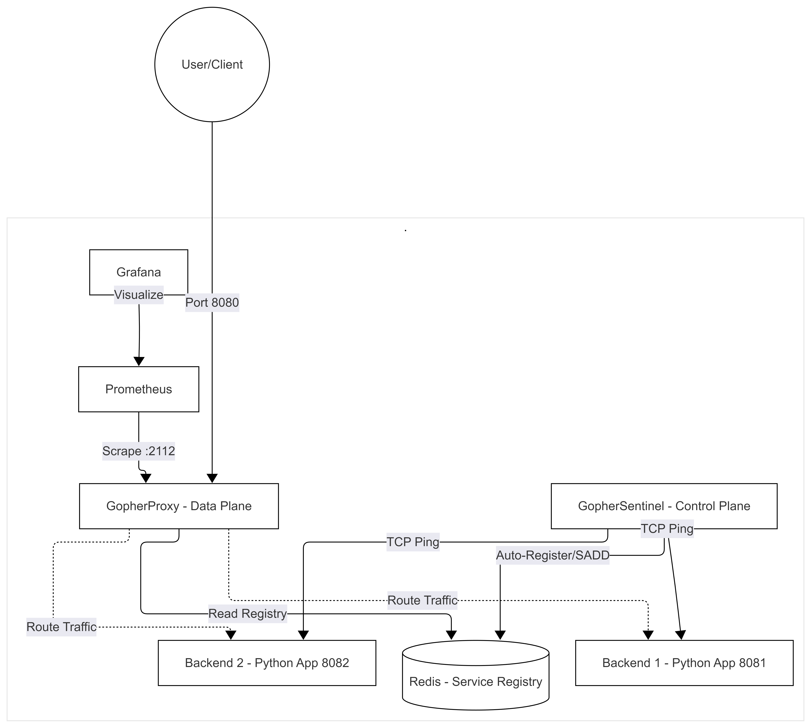

# GopherProxy & Sentinel: A Distributed Service Mesh Lite

### PROJECT VERSION: 1.0 - DEC 31, 2025

**GopherProxy & Sentinel** is a production-grade, health-aware Load Balancer and Service Discovery engine built entirely in Go. It simulates a cloud-native environment locally, featuring a decoupled Data Plane (Proxy) and Control Plane (Sentinel), managed via Redis, and fully observable through Prometheus and Grafana.

## Architecture Overview

The system follows a three-tier distributed architecture:
1.  **The Data Plane (GopherProxy):** A high-concurrency Go reverse proxy that routes traffic to healthy backends and enforces security via Rate Limiting.
2.  **The Control Plane (Sentinel):** An automated monitoring agent that pings backend ports and updates the shared Service Registry.
3.  **The Service Registry (Redis):** A persistent "Source of Truth" where backends are registered and de-duplicated.
4.  **The Observability Stack:** Prometheus scrapes metrics from the Proxy, and Grafana visualizes the traffic flow and backend health.

---

### Architecture Diagram


---

## Key Features

*   **Decoupled Service Discovery:** Uses Redis Sets to manage dynamic backend registration without restarting the proxy.
*   **High-Performance Concurrency:** Leverages `sync.RWMutex` for efficient multi-reader access and `sync/atomic` for thread-safe load balancing.
*   **Security & Hardening:** 
    *   **Rate Limiting:** Implements a Token Bucket algorithm to prevent local DDoS.
    *   **Graceful Shutdown:** Handles OS signals (`SIGINT`, `SIGTERM`) to ensure zero-drop connection closing.
    *   **Isolation:** Runs as a non-privileged `gopheruser` inside the container.
*   **Observability (SRE):** Exports custom Prometheus metrics including Request Counters and Healthy Backend Gauges.
*   **Cloud-Native Optimization:** Multi-stage Docker build using `ARG` and `Static Linking`, resulting in a tiny **13.4MB** image.

---

## Tech Stack

*   **Language:** Go (Standard Library, `httputil`, `context`)
*   **Registry:** Redis
*   **Monitoring:** Prometheus & Grafana
*   **Deployment:** Docker, Docker Compose
*   **Networking:** HTTP Reverse Proxy, TCP Dialing

---

## Getting Started

### Prerequisites
*   Docker & Docker Compose
*   Python (to run mock backend servers)

### 1. Build and Start the Cluster
```bash
docker-compose up --build
```

### 2. Start Local Backends (Microservices)
Open two separate terminals:
```bash
# Terminal A
python -m http.server 8081
# Terminal B
python -m http.server 8082
```

### 3. Generate Traffic
```bash
# Observe the Rate Limiter (2 req/sec)
for i in {1..50}; do curl -I http://localhost:8080; done
```

---

## License

This project is licensed under the MIT License - see the LICENSE file for details.